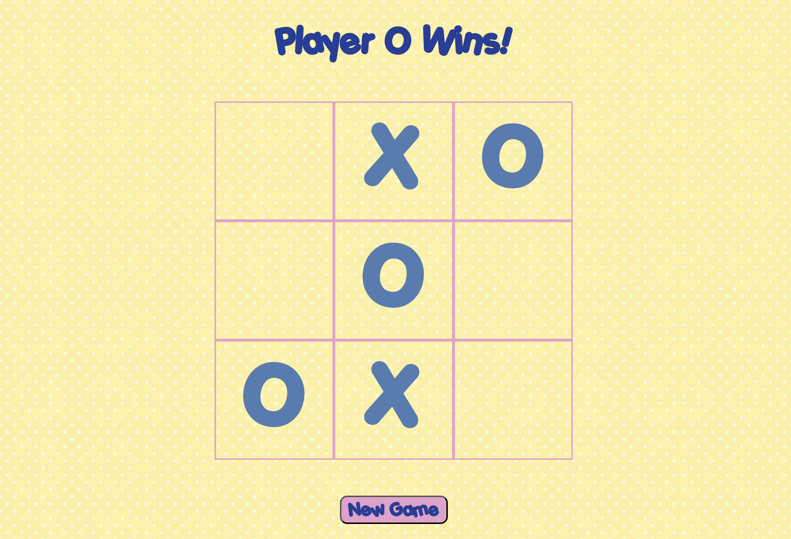

# Tic-Tac-Toe

🔗 **[Click here to play!](https://acesavvy101.github.io/Tic-Tac-Toe/)**

## Desktop View:

---

## New things I learned from this project:
  - Factory Functions
  - Scopes and Closures
  - Private Variables (encapsulation via closure)
  - IIFE (module patterns)
  - Objects

## Future Enhancements:
- I want to add the ability for players to input their names before starting the game.
- Play against a computer!

## Disclaimer:
The background image used in this project were sourced from Pinterest and are the property of their respective owners. This project is non commercial and intended for personal/educational use only.